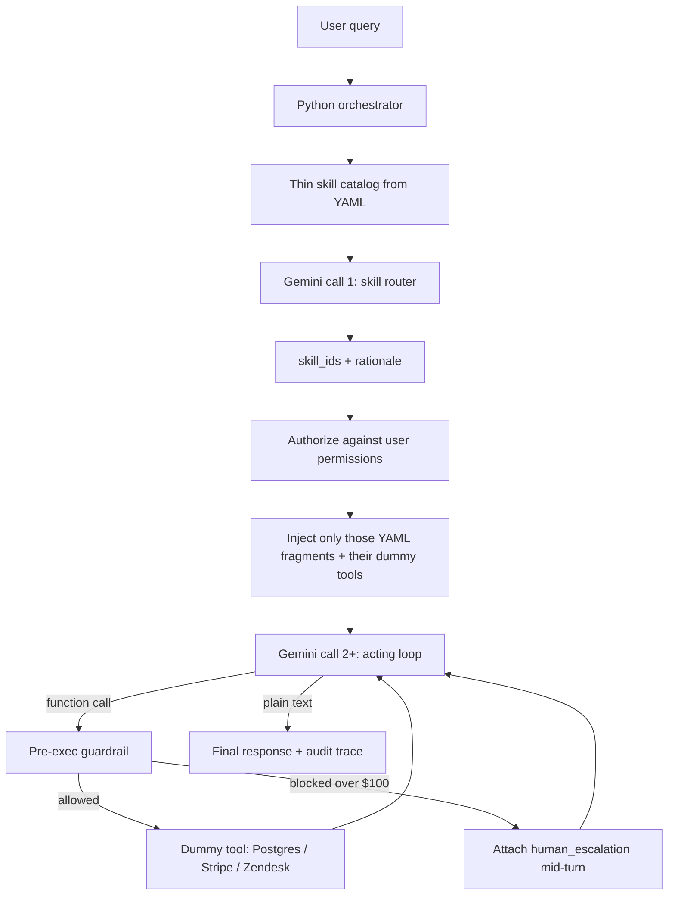

# Skill-Based Architecture

Gemini-powered proof of **dynamic skill-based context engineering** for an enterprise e-commerce / customer support hub.

**One Python orchestrator. One Gemini model. Two jobs per user turn.** There are not multiple agents. The same `gemini-2.5-flash` client is called first as a **skill router** (thin catalog only), then as an **acting loop** (selected YAML fragments + dummy tools). Guardrails wrap every tool call. Tools return in-memory dummy data — no live Postgres, Stripe, or Zendesk.

## Architecture flow



### Gemini calls per user turn

`gemini_calls` in the audit trace is **1 + N** (router + acting loop, cap 6 acting steps).

| # | Role | Prompt | Output |
| --- | --- | --- | --- |
| 1 | Skill router | Query + catalog cards (`id`, description, permissions, tool names). **No** YAML `system_prompt_fragment`. | JSON `{ skill_ids, rationale }` |
| 2… | Acting loop | Only authorized fragments + only those skills' dummy tool schemas. First step forces a tool call. | Function call **or** final text |

Typical counts:

- Order status / `$50` refund: **3** (router → tool → text).
- `$200` refund: **4** (router → `process_refund` blocked → `create_support_ticket` → text).

After a policy block, Python **attaches** `human_escalation` mid-turn. The router did not have to pick it; that is why the rationale may list only `execute_refund` while `dynamically_loaded_skills` lists both.

### What decides what

| Piece | Role |
| --- | --- |
| `skills/*.yaml` | Domain-expert contract: prompt fragment, permissions, tools, `$100` cap |
| `src/skill_registry.py` | Catalog cards + RBAC. Unauthorized skills never enter context |
| `src/guardrails.py` | Policy engine. The model cannot override a blocked Stripe write |
| `src/mock_tools.py` | In-memory fakes bound to env tokens (`POSTGRES_DATABASE_1`, …) |
| `src/orchestrator.py` | Sequences Gemini, tools, mid-turn skill load, audit trace |
| Gemini | Chooses skills, chooses tools, writes the customer-facing sentence |

## What the demo proves

1. **Skill routing** — Gemini chooses `order_status` vs `execute_refund` from catalog cards only.
2. **Dynamic context** — unused YAML fragments are not sent (trace shows catalog chars vs injected chars vs naive all-skills chars).
3. **Right dummy tool** — `fetch_order_details`, `process_refund`, or `create_support_ticket`.
4. **Governance stays outside the model** — Gemini must still call `process_refund` for a `$200` refund; `src/guardrails.py` blocks it and the engine attaches Zendesk.

## Setup

```bash
python3 -m venv .venv
source .venv/bin/activate
pip install -r requirements.txt
cp .env.example .env
```

Set `GEMINI_API_KEY` in `.env`. Optionally override `GEMINI_MODEL` (default `gemini-2.5-flash`). Dummy system tokens (`POSTGRES_DATABASE_1`, `STRIPE_PAYMENT_GATEWAY_1`, `ZENDESK_API_1`) already have mock defaults.

## Run the demo

```bash
python demo.py
```

1. **Turn 1** — “What's the status of order 4401?” → loads `order_status` → dummy `POSTGRES_DATABASE_1` read.
2. **Turn 2** — “I want a $50 refund on order #9928” → loads `execute_refund` → dummy Stripe **SUCCESS** (≤ `$100`).
3. **Turn 3** — “I want a $200 refund on order #9928” → `process_refund` **GUARDRAIL_BLOCKED_POLICY_VIOLATION** → dummy Zendesk ticket.

Each turn prints context sizes and the audit trace JSON.

```bash
python demo.py --interactive
python -m src.main --cli
```

## Layout

```
.
├── .env.example               # Tokenized systems + GEMINI_API_KEY
├── config.py
├── demo.py
├── skills/                    # YAML: prompts, perms, tools, policy.auto_approve_threshold_usd
│   ├── identify_user.yaml
│   ├── order_status.yaml
│   ├── execute_refund.yaml
│   └── human_escalation.yaml
└── src/
    ├── models.py              # Pydantic v2 traces, skills, dummy payloads
    ├── gemini_client.py       # Router JSON + manual function calling (AFC off)
    ├── tool_schemas.py        # Dummy tool declarations; sent only if skill loaded
    ├── skill_registry.py      # Catalog cards + RBAC
    ├── mock_tools.py          # In-memory dummy I/O
    ├── guardrails.py          # Pre/post execution policy
    ├── orchestrator.py        # Context builder + Gemini/tool loop
    └── main.py                # FastAPI + CLI
```

## API

```bash
python -m src.main
# GET  /health          — skills + whether GEMINI_API_KEY is set
# GET  /v1/skills       — YAML catalog
# POST /v1/agent/turn   — one user turn; returns AuditExecutionTrace
```
